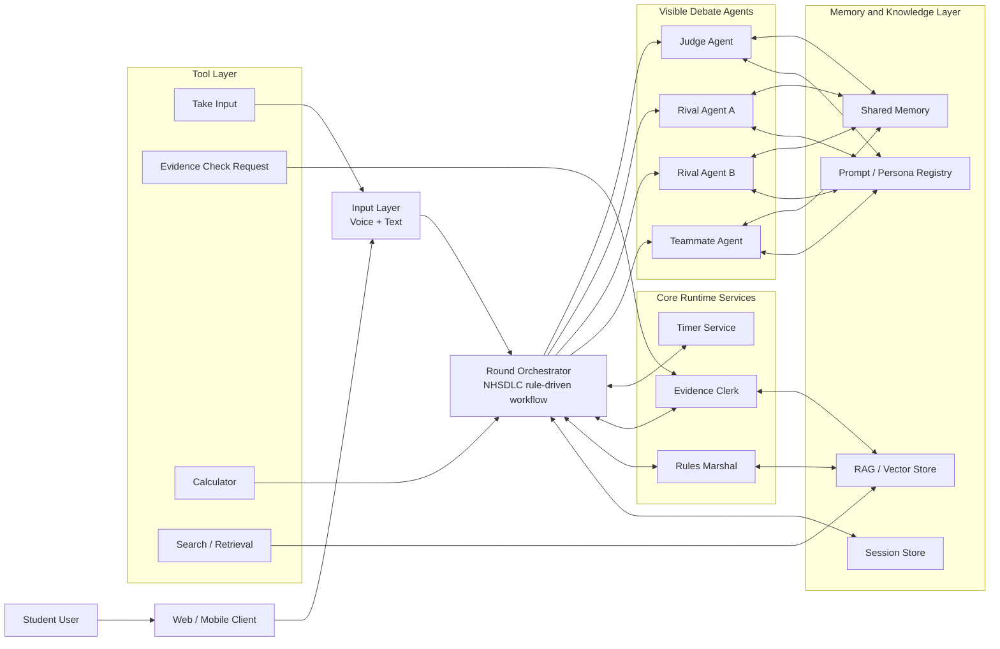

# Debate Agent Architecture Implementation Plan

> **For Claude:** REQUIRED SUB-SKILL: Use superpowers:executing-plans to implement this plan task-by-task.

**Goal:** Build a multi-agent NHSDLC debate practice app where a student can practice against rival agents, receive teammate coaching, and get judge feedback while the debate sequence is controlled by application code.

**Architecture:** The system uses four visible OpenAI Agents SDK agents: Judge, Rival A, Rival B, and Teammate. Debate order, timing, speaker roles, prep windows, evidence checks, and rule enforcement are controlled by a code-level Round Orchestrator, not by agent handoffs. Hidden services provide timing, evidence handling, rules checks, session memory, and RAG.

**Tech Stack:** Python, FastAPI, OpenAI Agents SDK, OpenAI Realtime/voice path where needed, Postgres, pgvector, Redis, Pydantic, pytest.

## Current Design Decisions

- The app follows the NHSDLC Public Forum rule structure in `rulebook.md`.
- The agent workflow is code-orchestrated by `RoundOrchestrator`.
- Agents do not auto-handoff to one another.
- The timer is a lower-level runtime service used by the orchestrator, not an agent tool.
- The visible student-facing cast stays small: Judge, Rival A, Rival B, and Teammate.
- Evidence and procedural checks are handled by hidden backend services or tools.
- RAG is role-aware: each agent receives only the context appropriate for its role and current phase.

## Architecture Diagram



## Component Mapping To OpenAI Agents SDK

### Judge Agent

**SDK component:** `Agent` for text mode, `RealtimeAgent` for live voice mode.

**Responsibilities:**
- Open and close the round.
- Explain rules and format constraints.
- Evaluate speeches and crossfire behavior.
- Track dropped arguments, weighing, new arguments in final focus, and speaker quality.
- Produce structured judge feedback and scores.

**SDK features:**
- `instructions`: NHSDLC judge role, educational tone, rubric, scoring rules.
- `tools`: transcript lookup, rulebook retrieval, evidence lookup, calculator if needed.
- `output_type`: Pydantic schema for judge decision and feedback.
- `input_guardrails`: block unsafe or format-breaking user requests.
- `output_guardrails`: detect unsupported rulings or unfair disclosure.

**No auto-handoffs:** Do not set `handoffs=[...]`.

### Rival Agent A

**SDK component:** `Agent` or `RealtimeAgent`.

**Responsibilities:**
- Act as one opponent debater.
- Speak only when called by the orchestrator.
- Use assigned side, speaker role, and phase.
- Generate constructive, rebuttal, crossfire, summary, or final focus content as requested.

**SDK features:**
- `instructions`: opponent persona, assigned side, phase-specific rules.
- `tools`: role-aware retrieval, evidence access, calculator if needed.
- `output_type`: optional structured speech/crossfire output.
- `guardrails`: prevent illegal new arguments in final focus and unsupported evidence claims.

**No auto-handoffs:** Do not set `handoffs=[...]`.

### Rival Agent B

**SDK component:** `Agent` or `RealtimeAgent`.

**Responsibilities:**
- Act as the second opponent debater or alternate opponent style.
- Support team-based practice and different pressure styles.
- Follow assigned speaker role from orchestrator state.

**SDK features:**
- Same as Rival Agent A.
- Separate persona prompt to create a different debating style.

**No auto-handoffs:** Do not set `handoffs=[...]`.

### Teammate Agent

**SDK component:** `Agent` or `RealtimeAgent`.

**Responsibilities:**
- Act as the student's partner or private coach.
- Help during prep and allowed coaching windows.
- Suggest strategy, rebuttal framing, weighing, and clarity improvements.
- Respect fairness boundaries and avoid leaking hidden opponent strategy.

**SDK features:**
- `instructions`: private teammate behavior, coaching boundaries, educational style.
- `tools`: transcript lookup, student history retrieval, rulebook retrieval, topic retrieval.
- `output_guardrails`: block hidden-opponent leakage and unfair assistance.

**No auto-handoffs:** Do not set `handoffs=[...]`.

### Round Orchestrator

**SDK component:** Application service that calls the SDK. This is not itself an SDK agent.

**Responsibilities:**
- Own the NHSDLC round state machine.
- Decide which agent runs next.
- Pass structured context into each agent run.
- Enforce speaker order, side assignment, prep time, crossfire windows, and final focus constraints.
- Coordinate evidence checks and procedural rulings.
- Persist round state and transcript events.

**SDK APIs used:**
- `Runner.run(...)`
- `Runner.run_streamed(...)`
- `RealtimeRunner` and `RealtimeSession` for voice mode
- `RunConfig`
- `context=...` with a typed app context object
- SDK tracing around each round and phase

**Important rule:** The orchestrator is the single source of truth for sequencing. Agents never decide who speaks next.

### Timer Service

**SDK component:** None directly. This is a backend service.

**Responsibilities:**
- Track speech time and prep time.
- Expose remaining time to orchestrator.
- Emit timer events for UI updates.
- Support pause/resume only where the rules allow.

**Integration:**
- The orchestrator reads timer state and injects relevant time context into agent calls.
- Agents do not call the timer as a tool.

### Evidence Clerk

**SDK component:** Function tools plus backend service logic.

**Responsibilities:**
- Record evidence claims.
- Validate citation completeness.
- Handle requests to view evidence in full or in context.
- Route evidence lookup to RAG or database records.
- Report evidence problems to the orchestrator and judge.

**SDK features:**
- `@function_tool` for evidence-related operations.
- Pydantic schemas for requests and results.
- Tool guardrails for malformed requests or forbidden timing.

**Candidate tools:**
- `retrieve_evidence`
- `record_evidence_claim`
- `check_citation_format`
- `show_evidence_in_full`
- `show_evidence_in_context`
- `record_evidence_check_request`

### Rules Marshal

**SDK component:** Start as deterministic backend logic. Add an internal agent only if rule interpretation becomes too ambiguous.

**Responsibilities:**
- Check procedural compliance against `rulebook.md`.
- Identify wrong side, wrong speaker role, excessive partner assistance, illegal prep timing, or new final-focus arguments.
- Tell orchestrator whether to warn, block, continue, or ask judge to note the issue.

**SDK features if promoted to an agent:**
- Internal `Agent` with rulebook retrieval.
- Structured output for procedural findings.
- No visible student persona.

### Session Store

**SDK component:** SDK session support for conversation memory plus application database state.

**Responsibilities:**
- Store recent agent messages and user turns.
- Keep round-level conversational continuity.

**Implementation note:**
- Do not rely only on SDK session memory for business state.
- Persist round state, side assignment, speaker roles, timers, and evidence events in application tables.

### Shared Memory

**SDK component:** SDK session plus app-level transcript store.

**Responsibilities:**
- Store transcript events.
- Make recent turn history available to agents.
- Provide phase-aware summaries to reduce prompt size.

### RAG / Vector Store

**SDK component:** Function tools or MCP tools.

**Responsibilities:**
- Retrieve rulebook sections.
- Retrieve topic packs, evidence cards, student history, curriculum notes, and past performance.
- Return role-aware context.

**Recommended first version:**
- Use local `@function_tool` retrieval functions.
- Add MCP later only when external tool inventory grows.

### Prompt / Persona Registry

**SDK component:** Agent factory configuration.

**Responsibilities:**
- Store reusable prompt templates.
- Build agent instructions from role, side, phase, difficulty, rubric, and student level.
- Version prompts for later evaluation.

## Suggested Code Structure

```text
backend/
  src/
    debate_agent/
      agents/
        judge.py
        rival_a.py
        rival_b.py
        teammate.py
        factory.py
      orchestration/
        round_orchestrator.py
        state_machine.py
        phases.py
      services/
        timer_service.py
        evidence_clerk.py
        rules_marshal.py
        transcript_service.py
      tools/
        evidence_tools.py
        retrieval_tools.py
        calculator_tools.py
      guardrails/
        input_guardrails.py
        output_guardrails.py
        tool_guardrails.py
      memory/
        session_store.py
        vector_store.py
        repositories.py
      schemas/
        agent_outputs.py
        debate_state.py
        evidence.py
        scoring.py
      api/
        routes_debate.py
        routes_voice.py
        routes_admin.py
      prompts/
        judge.md
        rival_a.md
        rival_b.md
        teammate.md
        shared_rules.md
  tests/
    unit/
    integration/
    fixtures/
```

## Core Data Models

### DebateSession

Fields:
- `id`
- `student_id`
- `topic`
- `student_side`
- `opponent_side`
- `format`
- `difficulty`
- `status`
- `created_at`
- `updated_at`

### DebateState

Fields:
- `session_id`
- `phase`
- `active_speaker`
- `student_speaker_role`
- `rival_a_speaker_role`
- `rival_b_speaker_role`
- `prep_time_remaining_student`
- `prep_time_remaining_opponent`
- `speech_time_remaining`
- `allowed_actions`

### TranscriptEvent

Fields:
- `id`
- `session_id`
- `phase`
- `speaker`
- `content`
- `start_time`
- `end_time`
- `source`
- `metadata`

### EvidenceClaim

Fields:
- `id`
- `session_id`
- `speaker`
- `claim_text`
- `author`
- `author_qualification`
- `publication_year`
- `title`
- `publication_date`
- `url`
- `quoted_text`
- `full_context`
- `citation_status`

### JudgeDecision

Fields:
- `session_id`
- `winner`
- `reason_for_decision`
- `student_speaker_points`
- `opponent_speaker_points`
- `key_issues`
- `rule_notes`
- `improvement_suggestions`

## NHSDLC Round State Machine

Exact times should be configured from the active rule format, not hard-coded inside agent prompts.

Suggested phases:

1. `setup`
2. `judge_opening`
3. `student_prep_optional`
4. `constructive_pro`
5. `constructive_con`
6. `crossfire_1`
7. `rebuttal_pro`
8. `rebuttal_con`
9. `crossfire_2`
10. `summary_pro`
11. `summary_con`
12. `grand_crossfire`
13. `final_focus_pro`
14. `final_focus_con`
15. `judge_deliberation`
16. `judge_feedback`
17. `complete`

The orchestrator should calculate the active agent from phase, side assignment, and speaker role.

## Implementation Plan

### Task 1: Project Scaffold

**Files:**
- Create: `backend/src/debate_agent/__init__.py`
- Create: `backend/src/debate_agent/schemas/debate_state.py`
- Create: `backend/src/debate_agent/orchestration/phases.py`
- Create: `backend/tests/unit/test_phases.py`

**Steps:**
1. Write tests for phase ordering and terminal state.
2. Implement enums for phase, side, speaker role, and agent role.
3. Add helper methods such as `next_phase(current_phase)`.
4. Run `pytest backend/tests/unit/test_phases.py -v`.

### Task 2: Round State Machine

**Files:**
- Create: `backend/src/debate_agent/orchestration/state_machine.py`
- Test: `backend/tests/unit/test_state_machine.py`

**Steps:**
1. Write tests for pro/con sequencing.
2. Write tests for first-speaker and second-speaker assignment.
3. Implement `RoundStateMachine`.
4. Run targeted tests.

### Task 3: Timer Service

**Files:**
- Create: `backend/src/debate_agent/services/timer_service.py`
- Test: `backend/tests/unit/test_timer_service.py`

**Steps:**
1. Write tests for starting, pausing, resuming, and expiring timers.
2. Implement timer state as backend logic.
3. Verify that timer is not exposed as an agent tool.
4. Run targeted tests.

### Task 4: Agent Output Schemas

**Files:**
- Create: `backend/src/debate_agent/schemas/agent_outputs.py`
- Create: `backend/src/debate_agent/schemas/scoring.py`
- Test: `backend/tests/unit/test_agent_output_schemas.py`

**Steps:**
1. Define Pydantic models for speech output, crossfire output, judge feedback, and rule notes.
2. Validate required fields.
3. Run schema tests.

### Task 5: Agent Factories

**Files:**
- Create: `backend/src/debate_agent/agents/judge.py`
- Create: `backend/src/debate_agent/agents/rival_a.py`
- Create: `backend/src/debate_agent/agents/rival_b.py`
- Create: `backend/src/debate_agent/agents/teammate.py`
- Create: `backend/src/debate_agent/agents/factory.py`
- Test: `backend/tests/unit/test_agent_factory.py`

**Steps:**
1. Write tests that each factory returns an SDK `Agent`.
2. Write tests that no agent has auto-handoffs configured.
3. Implement each agent factory with role-specific instructions.
4. Attach only approved tools per role.

### Task 6: Evidence Clerk And Tools

**Files:**
- Create: `backend/src/debate_agent/services/evidence_clerk.py`
- Create: `backend/src/debate_agent/tools/evidence_tools.py`
- Create: `backend/src/debate_agent/schemas/evidence.py`
- Test: `backend/tests/unit/test_evidence_clerk.py`

**Steps:**
1. Write tests for citation completeness.
2. Write tests for evidence in full and in context.
3. Implement evidence service logic.
4. Expose approved evidence operations through SDK function tools.

### Task 7: Retrieval Tools

**Files:**
- Create: `backend/src/debate_agent/memory/vector_store.py`
- Create: `backend/src/debate_agent/tools/retrieval_tools.py`
- Test: `backend/tests/unit/test_retrieval_tools.py`

**Steps:**
1. Write tests with fixture documents from the rulebook.
2. Implement role-aware retrieval interface.
3. Expose `search_rulebook`, `search_topic_pack`, and `search_student_history`.

### Task 8: Rules Marshal

**Files:**
- Create: `backend/src/debate_agent/services/rules_marshal.py`
- Test: `backend/tests/unit/test_rules_marshal.py`

**Steps:**
1. Write tests for wrong side detection.
2. Write tests for wrong speaker role detection.
3. Write tests for new final-focus argument flags.
4. Implement deterministic rule checks first.

### Task 9: Round Orchestrator

**Files:**
- Create: `backend/src/debate_agent/orchestration/round_orchestrator.py`
- Test: `backend/tests/integration/test_round_orchestrator.py`

**Steps:**
1. Write tests that the orchestrator calls agents in rule-defined order.
2. Mock SDK `Runner.run(...)`.
3. Verify timer service coordination.
4. Verify evidence-check interruptions are routed to Evidence Clerk.
5. Verify no agent handoff is required for phase progression.
6. Implement the orchestrator.

### Task 10: Memory And Persistence

**Files:**
- Create: `backend/src/debate_agent/memory/session_store.py`
- Create: `backend/src/debate_agent/memory/repositories.py`
- Test: `backend/tests/unit/test_session_store.py`

**Steps:**
1. Implement SDK session wiring for conversation history.
2. Implement application repositories for business state.
3. Add transcript event persistence.
4. Add student profile memory hooks.

### Task 11: API Layer

**Files:**
- Create: `backend/src/debate_agent/api/routes_debate.py`
- Create: `backend/src/debate_agent/api/routes_voice.py`
- Test: `backend/tests/integration/test_debate_routes.py`

**Steps:**
1. Add endpoint to create a debate session.
2. Add endpoint to submit student input.
3. Add endpoint to advance the round.
4. Add endpoint to request evidence check.
5. Add streaming or polling endpoint for transcript and timer events.

### Task 12: Voice Mode

**Files:**
- Create: `backend/src/debate_agent/api/routes_voice.py`
- Create: `backend/src/debate_agent/services/transcript_service.py`
- Test: `backend/tests/integration/test_voice_routes.py`

**Steps:**
1. Start with push-to-talk STT/TTS if realtime browser voice is not ready.
2. Add `RealtimeAgent` only after text orchestration is stable.
3. Keep the same orchestrator state machine for voice and text.
4. Verify interruptions do not bypass phase rules.

### Task 13: Evaluation And Regression Tests

**Files:**
- Create: `backend/tests/evals/test_debate_quality.py`
- Create: `backend/tests/fixtures/sample_rounds/`

**Steps:**
1. Create fixture rounds for common scenarios.
2. Test that final focus new arguments are flagged.
3. Test that judge feedback includes actionable student improvement advice.
4. Test that teammate does not leak hidden opponent strategy.
5. Test that evidence claims are handled consistently.

## MVP Scope

Build these first:

- Text-only Round Orchestrator.
- Judge Agent.
- Rival A Agent.
- Teammate Agent.
- Timer Service.
- Evidence Clerk with basic citation checks.
- Rulebook retrieval.
- Session transcript storage.

Defer these until after MVP:

- Rival B.
- Live realtime voice.
- Teacher dashboard.
- Advanced student memory.
- Full evidence library management.
- MCP integration.

## Non-Goals For First Version

- Do not use agent auto-handoffs for debate flow.
- Do not make timer an SDK tool.
- Do not let agents decide the next debate phase.
- Do not build a general-purpose debate platform before the NHSDLC state machine works.
- Do not add complex planning agents.

## Verification Checklist

- Unit tests cover phase transitions.
- Unit tests prove agents have no configured handoffs.
- Unit tests cover timer behavior.
- Unit tests cover evidence citation validation.
- Integration tests prove orchestrator calls agents in NHSDLC order.
- Integration tests prove evidence check can interrupt between speeches or during crossfire according to rules.
- Guardrail tests cover final-focus new arguments and private teammate boundaries.

## Reference Documents

- `rulebook.md`: NHSDLC rulebook used for round procedure and evidence rules.
- OpenAI Agents SDK docs: agents, tools, sessions, guardrails, tracing, and realtime agents.
